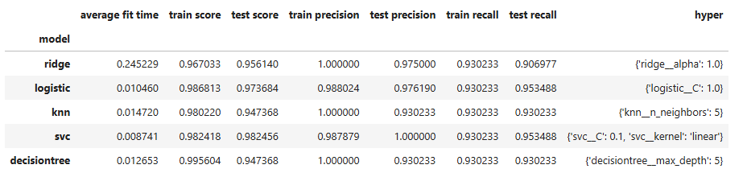
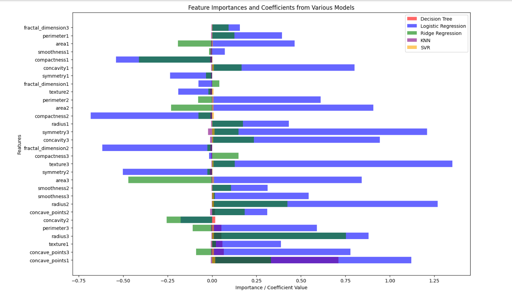

# Machine Learning and Artificial Intelligence - Capstone Project
**What determines the Breast Cancer is Maligment or Benign?**

## Executive summary
### Project overview and goals
The goal of this project is to identify what are the important factors that determine if a Breast Cancer is Malignament or Benign. This is a Binary Classification problem with two possible outcomes Malignent or Benign. We will be using several AL/ML Classification techniques to determine that. We will start with a simple model and then develop a more complex model with hyperparameter tuning. The grid search 5 fold validation technique will be used to come up with an optimal solution. Several ploats and DataFrame will be used to show model behavior.

### Findings

Most of the models did pretty well, but the best model is the Support Vector Classifier model. The values and time are shown below in a DataFrame. The Python notebook displays the confusion matrix and feature importance values for each of the models.

A consolidated feature important plot is presented here

### Results and conclusion
In conclusion, we started with a simple model and used hyperparameter turning to find an optimal model. The SVC model performed best.

## Data
**Source**

    https://archive.ics.uci.edu/dataset/17/breast+cancer+wisconsin+diagnostic
## Technique
The following Classification Tenchiques will be used for modeling

    - KNN
    - Logistic Regression
    - Ridge Regression
    - Decision Tree
    - Support Vector Machine

## Expected Results
The Classification model will predict two categories Malignment and Benign based on test data.

    Malignment - Breast cancer is defined as malignment.
    Benign - Breast cancer is defined as benign.

## Why this question is important
The model is used to predict the nature of breast cancer. It helps with the diagnosis and will help patients to decide on further treatment.

### Best Model
    - SVC Model
        - Because of High Accuracy, Precision and Recall value.
### Limitation
    - Data set is relativly small because of (mem/cpu) limitation
    - Couldn't go higher SVC Hyperparameter because of limited resource (mem/cpu)
### File Structure
- README.md - Read me file for the project
- Capstone.ipynb - The Juypter notebook file. Contains code.
- images folder - Contains images

### Future Enhancement - Deep Neural Network
We tried to fit a Deep Neural Network to make a comparison with other models. The dataset used for this project is small. But in the future this model can be tuned for a large dataset. The Deep Neural Neotwork model will certainly be helpful in that case.
